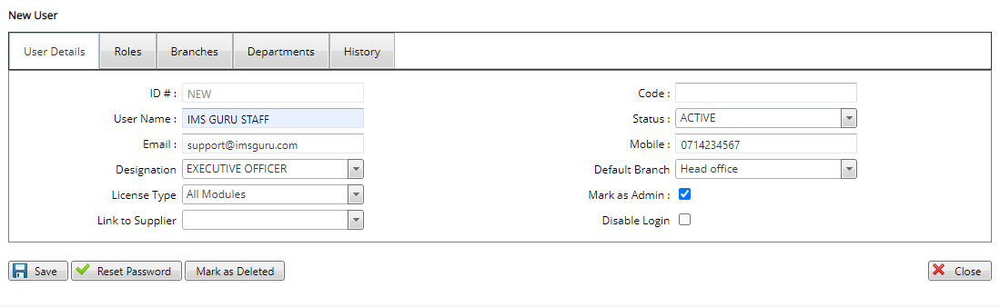

# How to create a New User

***Creating a New User***

- Log on into the system through the web application.
- On the main menu which appears on the left side of the screen click on the security tab.
- Under the security tab click on manage users.
- On the pop up screen click on new user at the top left bar.
- Under the user details page key in the username,the email and the mobile number.
- Specify the designation of the user I.e accountant.
- Under the license type check the modules the user is allowed to work on I.e all modules.
- If the user is an administrator check the mark as Admin tab to enable.
- Click on the save button to create the user.

 ## Assigning Roles
 
***How to assign roles***

- On the same new user page click on the roles tab at the top bar.
- On the pop up screen check the roles to assign to the user.
- Click on the save button
 ## Assigning Branches
 
***This is the image caption***

 - Still on the same new user page click on the branches tab at the top bar.
- On the pop up screen check the branches that the user can access.
- Click on the save button.

