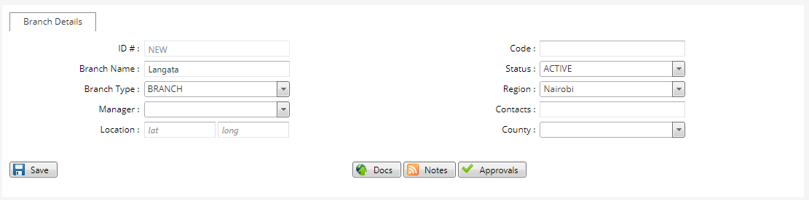

# Setting up Branches

***Setting up Branches***

- On the main menu click on general setup tab.
- On the general setup tab drop down click on branches.
- On the branches page click on new branch at the top left bar.
- On the new branch screen type in the branch name.
- Select the region under which the branch falls into.
- Check the branch type as branch or an agency.
- Click on the save button to create the branch.
