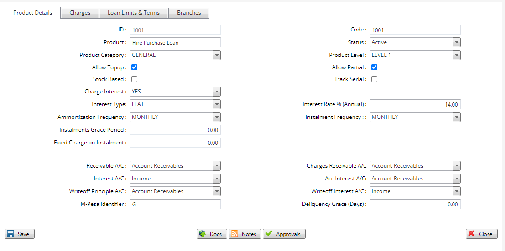
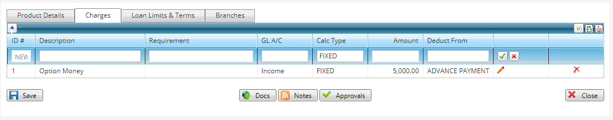
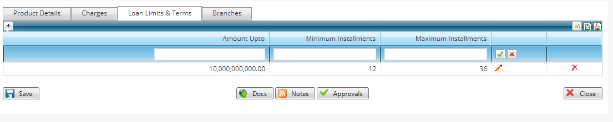
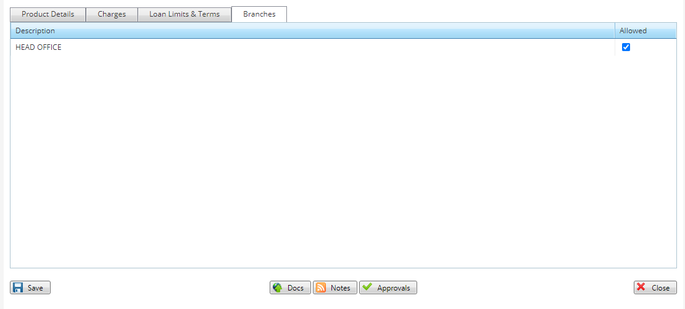

# Setting up Loan Products

***Loan Product Setup***

- On the main menu click on general setup tab.
- On the drop down menu click on loan products.
- On the loan products page click on new loan product.
- On the table that appears type in the product name.
- Specify the product category I.e loans,refinance.
- Enter the product level I.e level 1/2 according to what the Sacco offers.
- Check the allow top up tab if you accommodate loan top ups.
- Check the allow partial tab to allow disbursal in bits.
- Check the stock based tab if you are delivering an item to the customer instead of money.
- Indicate if there is any interest to be charged on the product.
- Indicate the interest type I.e reducing, flat.
- Indicate the interest rate per annum.
- Select the amortization frequency.
- Indicate the installment frequency either weekly, monthly.
- Indicate the installment grace period if you offer any.
- Enter the fixed charge on installment.
- Key in the receivable account for the loan.
- Indicate also the charge receivables account for the charges.
- Indicate the interest accounts.
- Key in the write-off principle account.
- Key in the write-off interest account.
- For instances of m-pesa payments put an m-pesa identifier.
- Indicate the delinquency grace days if you offer any.
- Click on the save button to create the loan product. 

   ## Adding Charges 
   
***Adding Charges to a Loan Product***

- Click on the loan products tab and select the newly created product I.e main loan.
- On the main loan page that opens click on the charges tab at the top bar .
- Add the charges that apply on this loan product.
- Click on the save button to add the charges.
  
  ## Setting Loan Limits & Terms 
  
***Assigning Loan Limits & Terms to a Loan Product***

- Again on the newly created loan product I.e main loan. 
- Click on the loan limits & terms for the loan product.
- On this page enter the minimum amount to lend and indicate the minimum and maximum installments for repayment.
- Enter the maximum amount to lend and also indicate the minimum and maximum installments for the same.
- Click on the save button to add the limits and terms.
  ## Selecting the Branch 

***Assigning a Loan Product to a Branch ***

- On the same loan product page click on the branches tab on the top bar.
- Select the branch under which you want the loan product.
- Click on the save button for it to apply.
