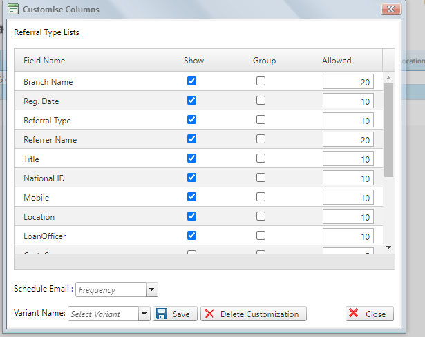

# Setting up Referral Type Lists 

***Setting up Referral Type Lists***

- On the main menu click on general setup.
- On the drop down menu select referral type list tab.
- On the referral type list new page that appears click on customize tab at the top left.
- On the new page check or tick the referral type lists that you want to appear on specific pages.
- Click on the save button to effect.
