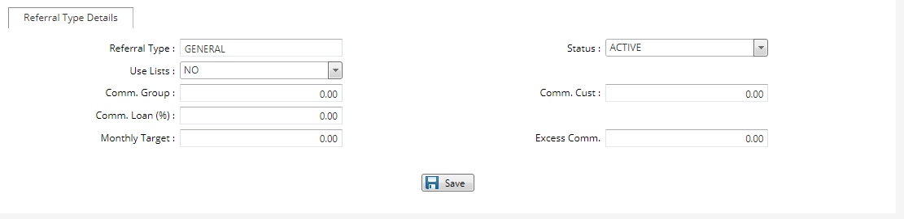

# Setting up Referral Types

***Setting up Referral Types***

- On the main menu click on general setup.
- On the drop down menu select referral type setup tab.
- On the referral type setup page click on new referral type tab at the top bar.
- On the new page key in the new referral type name.
- Tick on whether to use in the referral lists.
- Click on the save button.
