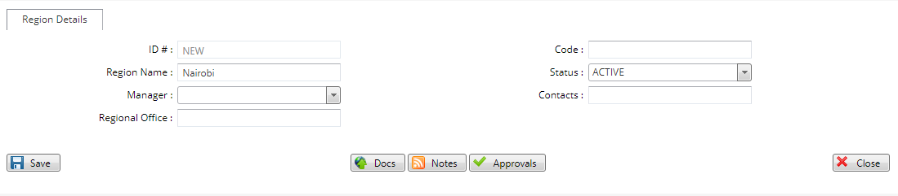

# Setting Up Regions

***Setting up Regions***

- On the main menu click on general setup tab.
- Under the general set up drop down click on regions.
- On the regions page click on the new region tab at the top left bar..
- On the pop up screen type in the region name.
- Click on the save button to create the region.