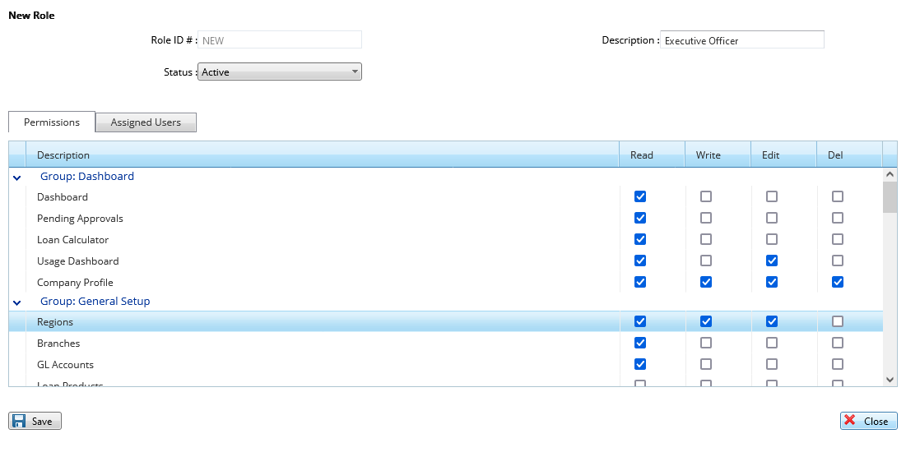

# How to create User Roles

***The New Role user interface on the website.***
-  On the the main menu click on the Security tab .
-  On the drop down menu that appears click on manage roles.
- On the pop up screen click on the new roles tab on the top left bar.
- On the table that appears enter the description of the new role you want to create.
- Under the permissions bar check by ticking the permissions you want to give to this role in all the fields I.e dashboard, general setup…
- Click on the save button and the role is created.